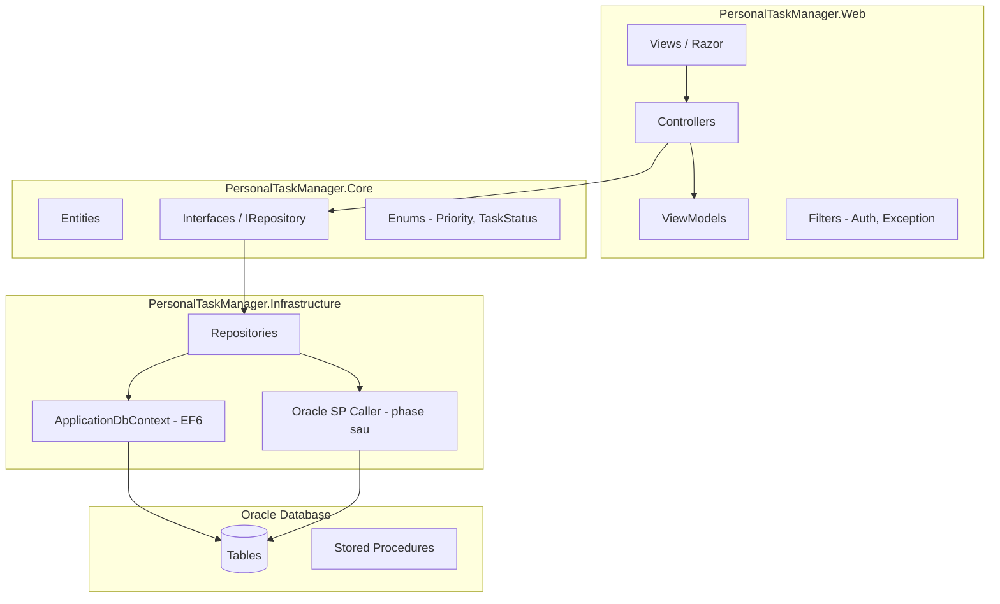
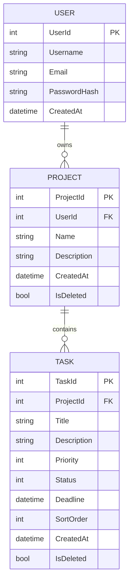

# Kiến trúc hệ thống

## Tổng quan layer



## Luồng request MVC điển hình

```
HTTP Request
  → RouteConfig (Global.asax)
  → Controller Action
  → [Authorize] / Custom Filter
  → Service hoặc Repository (LINQ / SP)
  → Entity / DTO
  → ViewModel
  → Razor View (+ _Layout)
  → HTTP Response
```

## Cấu trúc thư mục Web project

```
PersonalTaskManager.Web/
├── App_Start/
│   ├── RouteConfig.cs
│   ├── BundleConfig.cs
│   └── FilterConfig.cs
├── Controllers/
│   ├── AccountController.cs      # Login, Register, Logout
│   ├── ProjectController.cs
│   ├── TaskController.cs
│   ├── KanbanController.cs
│   └── ReportController.cs
├── Models/                       # ViewModels (không nhầm Entity)
│   ├── Account/
│   ├── Project/
│   └── Task/
├── Views/
│   ├── Shared/
│   │   ├── _Layout.cshtml
│   │   ├── _LoginPartial.cshtml
│   │   └── Error.cshtml
│   ├── Account/
│   ├── Project/
│   ├── Task/
│   ├── Kanban/
│   └── Report/
├── Content/                      # CSS, images
├── Scripts/                      # jQuery, validation, sortable
├── Filters/
│   └── AuthorizeUserAttribute.cs
└── Web.config
```

## Entity quan hệ (dự kiến)



## Authentication

| Thành phần | Cách dùng |
|------------|-----------|
| Forms Authentication | Cookie sau login thành công |
| Session | `UserId`, `Username` (tùy chọn, bổ sung cookie) |
| `[Authorize]` | Bảo vệ controller/action cần đăng nhập |
| Password | Hash bằng PBKDF2 hoặc ASP.NET Identity pattern (không lưu plain text) |

## Data access strategy

| Giai đoạn | Cách tiếp cận |
|-----------|---------------|
| Phase 1–6 | **EF6 Code First** — LINQ trong Repository |
| Phase 7+ | Giữ EF; thêm **Oracle SP** cho move task, audit log (học SP song song) |
| Query | Luôn filter `UserId` / `Project.UserId` — tránh leak dữ liệu |

## Ajax endpoints (phase 7+)

```
POST /Task/UpdateStatus     { taskId, newStatus }
POST /Task/Move             { taskId, newStatus, sortOrder }
GET  /Kanban/GetBoard/{projectId}   → JSON
```

Trả về `JsonResult` với `{ success, message, data }`.

## Validation

| Layer | Công cụ |
|-------|---------|
| Client | HTML5 `required`, `data-val-*`, jQuery Unobtrusive Validation |
| Server | Data Annotations trên ViewModel + `ModelState.IsValid` |
| DB | NOT NULL, FK, CHECK constraints trong Oracle |

## Ghi chú triển khai

- .NET Framework 4.8 → deploy **Windows + IIS**
- Connection string đặt trong `Web.config` + transform `Web.Release.config`
- `Oracle.ManagedDataAccess` + EF6 provider configuration trong `Web.config`
