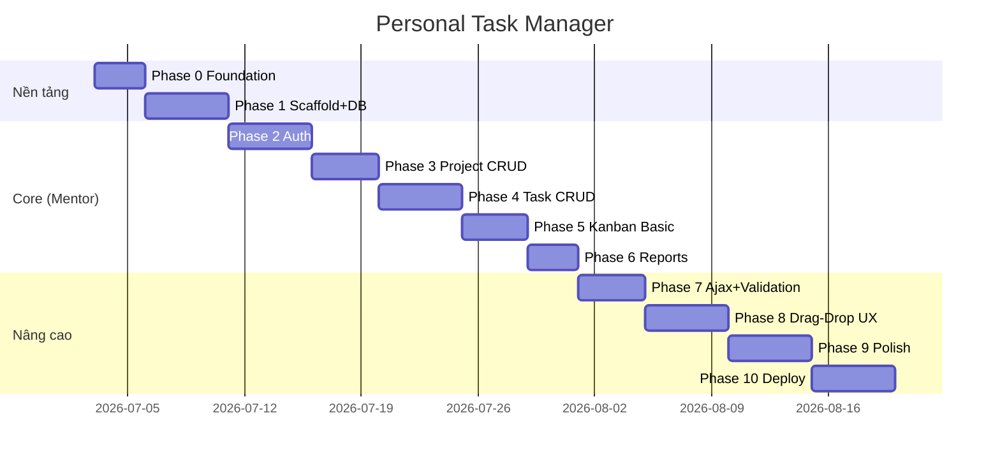

# Roadmap dự án — Tất cả Phase

> **File tổng hợp chính.** Mỗi phase có file chi tiết trong `docs/phases/` và **kế hoạch kiểm tra** ở cuối file đó.

## Tổng quan timeline



## Bảng phase

| Phase | Tên | Mục tiêu | Branch gợi ý | Trạng thái |
|-------|-----|----------|--------------|------------|
| **0** | [Foundation](phases/phase-00-foundation.md) | Docs, rules, skills, khung repo | `chore/phase-00-foundation` | 🟢 Hoàn thành |
| **1** | [Scaffold + Database](phases/phase-01-scaffold-database.md) | Solution MVC, EF, schema Oracle | `feature/phase-01-scaffold` | 🟢 Hoàn thành |
| **2** | [Authentication](phases/phase-02-authentication.md) | Login, Register, Logout, Layout | `feature/phase-02-auth` | 🟢 Hoàn thành |
| **3** | [Project CRUD](phases/phase-03-project-crud.md) | CRUD dự án, phân quyền theo user | `feature/phase-03-project` | 🟢 Hoàn thành |
| **4** | [Task CRUD](phases/phase-04-task-crud.md) | CRUD task, enum priority/status | `feature/phase-04-task` | 🟢 Hoàn thành |
| **5** | [Kanban Basic](phases/phase-05-kanban-basic.md) | 3 cột, nút Start/Done | `feature/phase-05-kanban` | 🟢 Hoàn thành |
| **6** | [Reports](phases/phase-06-reports.md) | Progress bar % hoàn thành | `feature/phase-06-reports` | 🟢 Hoàn thành |
| **7** | [Ajax & Validation](phases/phase-07-ajax-validation.md) | Cập nhật không reload, validate đầy đủ | `feature/phase-07-ajax` | 🟢 Hoàn thành |
| **8** | [Drag-Drop Kanban](phases/phase-08-drag-drop.md) | SortableJS, reorder | `feature/phase-08-dragdrop` | 🟢 Hoàn thành |
| **9** | [Polish & Extras](phases/phase-09-polish.md) | Filter, activity log, dashboard, dark mode | `feature/phase-09-polish` | 🔵 Hiện tại |
| **10** | [Deploy](phases/phase-10-deploy.md) | IIS/AWS, HTTPS, CI cơ bản | `feature/phase-10-deploy` | ⚪ |

**Chú thích trạng thái:** 🔵 Hiện tại · 🟡 Đang làm · 🟢 Hoàn thành · ⚪ Chưa bắt đầu

---

## Mapping yêu cầu mentor → phase

| Yêu cầu mentor | Phase đáp ứng |
|----------------|---------------|
| MVC, Router, Razor | 0, 1, 2 |
| EF kết nối DB | 1 |
| Layout, Session/Cookie | 2 |
| HTML/CSS/Bootstrap, Validation, LINQ | 2–7 |
| Login/Logout/Đăng ký | 2 |
| CRUD Project | 3 |
| CRUD Task | 4 |
| Kanban 3 cột + nút chuyển trạng thái | 5 |
| Báo cáo progress bar | 6 |
| Ajax không reload | 7 |
| Git flow + PR | Mọi phase |

---

## Quy trình làm việc mỗi phase

```
1. Đọc file phase chi tiết (docs/phases/phase-XX-*.md)
2. git checkout develop && git pull
3. git checkout -b feature/phase-XX-<tên-ngắn>
4. Implement theo Acceptance Criteria
5. Chạy Kế hoạch kiểm tra (checklist cuối file phase)
6. Commit theo CONVENTIONS → Push → Tạo PR → Mentor review
7. Merge develop → Cập nhật trạng thái bảng trên
```

---

## Kế hoạch kiểm tra tổng hợp (sau mỗi phase)

Dùng checklist **trong file phase tương ứng**. Dưới đây là tiêu chí chung áp dụng cho **mọi** phase:

### Kiểm tra kỹ thuật chung

- [ ] Build solution không lỗi (`Debug` configuration)
- [ ] Không có secret (connection string thật) commit lên Git
- [ ] Code tuân thủ [CONVENTIONS.md](CONVENTIONS.md)
- [ ] Comment ở các action/filter xử lý logic nghiệp vụ
- [ ] PR có mô tả: phase nào, làm gì, cách test

### Kiểm tra Git

- [ ] Branch đặt tên đúng convention (`feature/`, `fix/`, `chore/`)
- [ ] PR target `develop` (không trực tiếp vào `main` khi đang dev)
- [ ] Ít nhất 1 commit message rõ ràng theo format

### Kiểm tra bảo mật cơ bản

- [ ] Input user được validate server-side (`ModelState.IsValid`)
- [ ] User A không truy cập/sửa dữ liệu của User B (sau phase 2)

---

## Phase gate — khi nào được sang phase tiếp?

| Điều kiện | Bắt buộc |
|-----------|----------|
| 100% checklist phase hiện tại | ✅ |
| PR merged vào `develop` | ✅ |
| Mentor approve (nếu có) | ✅ (môi trường công ty) |
| Không có bug blocker mở | ✅ |

---

## Cập nhật trạng thái

Khi hoàn thành một phase, sửa cột **Trạng thái** trong bảng trên và ghi ngày hoàn thành vào file phase tương ứng.

**Phase hiện tại:** Phase 2 — Authentication
